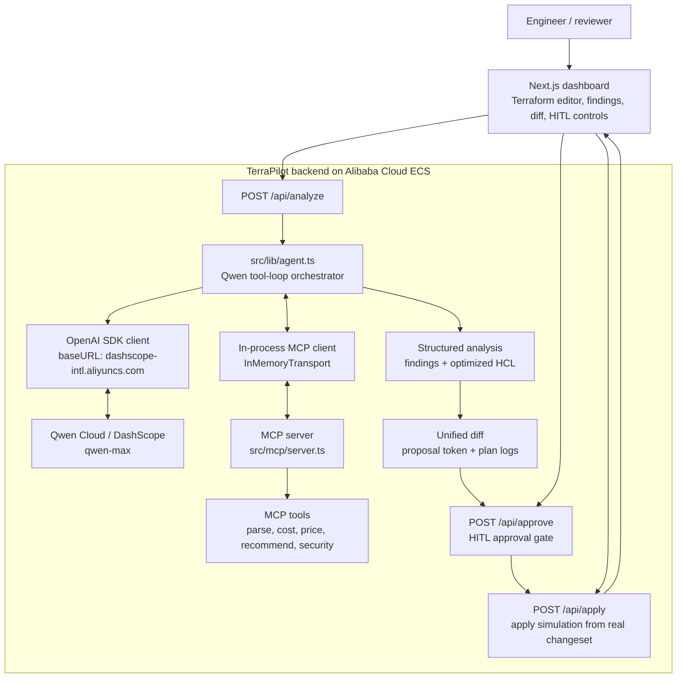

# TerraPilot (Track 4: Autopilot Agent)

TerraPilot is an autonomous **FinOps & Cloud Architecture Agent** built for the
**Global AI Hackathon with Qwen Cloud**. It takes Terraform HCL, reasons over it
with `qwen-max` **through a real MCP tool-loop**, grounds every recommendation in
deterministic pricing/security data, and drives a **Human-in-the-Loop approval
pipeline** (Propose → Approve → Apply) before any change is applied.

- **Agent, not a single prompt.** Qwen `qwen-max` invokes 5 MCP tools
  (`parseTerraform`, `estimateMonthlyCost`, `recommendInstance`,
  `checkSecurityRules`, `getInstancePricing`) in a recursive multi-round loop,
  then synthesizes findings + optimized HCL.
- **Why `qwen-max`?** Its large context window and strong reasoning capabilities
  are required to keep track of complex HCL resource dependencies while
  orchestrating up to 5 different tools without losing context.
- **Grounded, not hallucinated.** Savings figures come from the tools, not the
  model's imagination.
- **Real HITL.** A server-side approval token gates `apply` — you cannot apply
  without an explicit human approval.
- **Enterprise-grade fallback.** If `QWEN_API_KEY` is missing, the agent degrades
  gracefully to a deterministic local FinOps engine, so the product always works.

---

## 🧭 Architecture



The Qwen tool-loop: `parseTerraform` → `estimateMonthlyCost` →
`recommendInstance` (per resource) → `checkSecurityRules` → synthesize
findings + optimized HCL.

If `QWEN_API_KEY` is absent, the agent falls back to a deterministic local
FinOps engine. This graceful degradation is treated as a feature, not a bug:
production systems must keep operating when an upstream provider is unavailable,
so TerraPilot can be evaluated and deployed even without a key.

---

## 🧩 MCP Tools

Exposed by `src/mcp/` as a standalone MCP server (`npm run mcp`) and consumed
**in-process** by the agent via the in-memory transport.

| Tool | Purpose |
|---|---|
| `parse_terraform` | HCL → structured resources (type, name, kind, attributes) |
| `get_instance_pricing` | Monthly USD for an instance type (real table + heuristic) |
| `recommend_instance` | Deterministic rightsizing heuristics (dev → smaller class) |
| `check_security_rules` | Detects admin ports open to `0.0.0.0/0` |
| `estimate_monthly_cost` | Total monthly cost baseline for all billable resources |

### In-Memory MCP Transport Layer

Instead of opening raw network ports locally, the MCP server is launched inside
the same Node.js process and connected to the agent through `InMemoryTransport`
(`src/mcp/client.ts`). This removes local socket exposure, removes startup
latency from TCP handshake / stdio spawning, and keeps the entire tool surface
inside the application security boundary — a safer and lower-latency architecture
for an AI agent that calls tools recursively.

---

## 📂 Directory Structure

```text
terrapilot/
├── src/
│   ├── app/
│   │   ├── api/
│   │   │   ├── analyze/route.ts     # Agent run + diff + proposal token
│   │   │   ├── approve/route.ts     # HITL: proposed → approved
│   │   │   └── apply/route.ts       # HITL: approved → applied (gated)
│   │   ├── globals.css
│   │   ├── layout.tsx               # Sora + JetBrains Mono fonts
│   │   └── page.tsx                 # Dashboard: editor, findings, diff, pipeline
│   ├── lib/
│   │   ├── agent.ts                 # Qwen tool-loop orchestrator
│   │   ├── qwen.ts                  # Qwen Cloud client (DashScope endpoint)
│   │   ├── diff.ts                  # Unified line-diff (LCS, hunks)
│   │   ├── pipeline.ts              # Changeset → deterministic plan/apply logs
│   │   ├── proposals.ts             # In-memory proposal store + approval token
│   │   ├── fallback.ts              # Deterministic local FinOps engine
│   │   └── types.ts
│   └── mcp/
│       ├── tools.ts                 # 5 tool implementations + schemas
│       ├── server.ts                # MCP server (factory + stdio)
│       ├── client.ts                # In-memory MCP client + OpenAI tool defs
│       └── run.ts                   # Standalone entry: `npm run mcp`
├── Dockerfile                       # Standalone Next.js production image
├── DEPLOYMENT.md                    # Alibaba Cloud ECS deployment guide
├── .env.example                     # Qwen Cloud config template
└── package.json
```

---

## 🛠️ Getting Started

### 1. Prerequisites
- Node.js **20.x**
- npm

### 2. Environment setup
```bash
cp .env.example .env.local
```
Edit `.env.local`:
```env
QWEN_API_KEY=your_qwen_cloud_api_key_here
QWEN_BASE_URL=https://dashscope-intl.aliyuncs.com/compatible-mode/v1
QWEN_MODEL=qwen-max
```
> [!NOTE]
> **Fallback mode (Enterprise resilience)**: if `QWEN_API_KEY` is empty, the
> deterministic local FinOps engine handles analysis so the app runs
> out-of-the-box for evaluation. The system degrades gracefully instead of
> failing hard when the upstream LLM provider is unavailable.

### 3. Run
```bash
npm run dev      # http://localhost:3000
npm run build && npm start   # production
npm run mcp      # run the MCP server standalone (stdio)
```

---

## 🧠 Qwen Cloud Integration (Proof of Deployment #1)

TerraPilot calls Qwen Cloud through Alibaba Cloud DashScope's OpenAI-compatible
endpoint. The Qwen Cloud **Base URL** is defined in [`src/lib/qwen.ts`](./src/lib/qwen.ts):

```
https://dashscope-intl.aliyuncs.com/compatible-mode/v1
```

```typescript
const openai = new OpenAI({
  apiKey: process.env.QWEN_API_KEY,
  baseURL: process.env.QWEN_BASE_URL || 'https://dashscope-intl.aliyuncs.com/compatible-mode/v1',
});
```

The agent drives `qwen-max` through an MCP tool-loop (tools provided as OpenAI
function-calling definitions) and parses the final structured JSON into findings
+ optimized Terraform.

`qwen-max` was chosen deliberately: its large context window and strong logical
reasoning skills are needed to hold the full HCL dependency graph in memory while
recursively invoking 5 distinct tools, correlating their outputs, and producing
a coherent optimized configuration.

---

## 🔒 Human-in-the-Loop Pipeline

TerraPilot never applies changes blindly. The pipeline is a real,
server-validated state machine:

```
analyze  ─►  proposed  ─►[human approves]─►  approved  ─►[apply]─►  applied
                               (token gate)                    (gated)
```

- `/api/analyze` returns findings, a unified **diff**, a **plan**, and an opaque
  **approval token** bound to the optimized HCL.
- `/api/approve` records the human approval (HITL checkpoint).
- `/api/apply` **refuses to run** until the token is approved (`409` otherwise),
  then produces deterministic plan/apply logs derived from the real changeset —
  not a scripted animation.

### Blind AI vs Safe AI

Most AI agents generate infrastructure changes and apply them immediately. That
"Blind AI" pattern creates compliance, security, and cost risks at production
scale. TerraPilot is built as **Safe AI**: every proposed change is
human-approved through a cryptographically random token gate (`src/lib/proposals.ts`)
before `apply` can run. Teams keep the speed of AI assistance without surrendering
operational control.

---

## ☁️ Alibaba Cloud Deployment (Proof of Deployment #2)

The production image runs on **Alibaba Cloud ECS**. Full step-by-step guide
(create instance → Docker deploy → verify → capture proof screenshots) is in
[**DEPLOYMENT.md**](./DEPLOYMENT.md).

Quick deploy on an ECS instance (Alibaba Cloud Linux 3):

```bash
sudo dnf install -y docker && sudo systemctl enable --now docker
git clone https://github.com/oxyplay/terrapilot.git && cd terrapilot
docker build -t terrapilot .
docker run -d --name terrapilot --restart=always -p 3000:3000 \
  -e QWEN_API_KEY=sk-xxxxxxxx \
  -e QWEN_BASE_URL=https://dashscope-intl.aliyuncs.com/compatible-mode/v1 \
  -e QWEN_MODEL=qwen-max \
  terrapilot
# open security group port 3000, then http://<PUBLIC-IP>:3000
```

**Proof of deployment** = (1) a code file with the Qwen Cloud Base URL
([`src/lib/qwen.ts`](./src/lib/qwen.ts)) + (2) a screenshot of the running ECS
instance in Alibaba Cloud Workbench. See `DEPLOYMENT.md` §6.

---

## 📄 License

[MIT](./LICENSE) © TerraPilot Contributors
