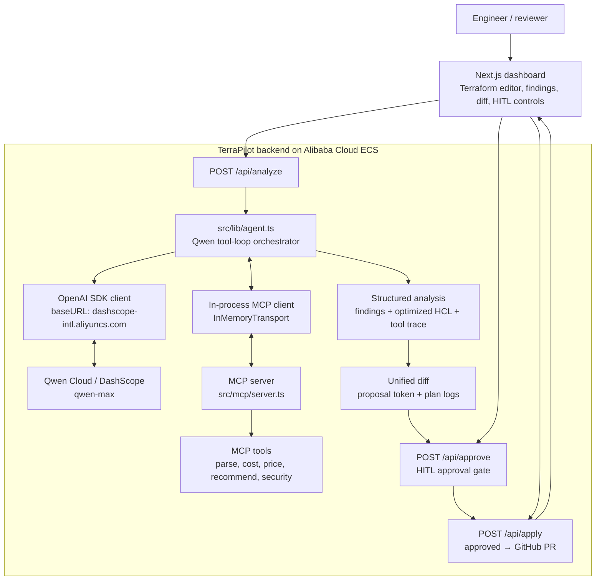

# TerraPilot (Track 4: Autopilot Agent)

TerraPilot is an autonomous FinOps and Cloud Architecture Agent built for the
Global AI Hackathon with Qwen Cloud. It ingests Terraform HCL, reasons over it
with `qwen-max` through a real MCP tool-loop, grounds every recommendation in
deterministic pricing and security data, and enforces a Human-in-the-Loop
approval pipeline (Propose → Approve → Create PR) before any change reaches
infrastructure.

- **Agent, not a single prompt.** `qwen-max` invokes five MCP tools
  (`parseTerraform`, `estimateMonthlyCost`, `recommendInstance`,
  `checkSecurityRules`, `getInstancePricing`) in a recursive multi-round loop,
  then synthesizes findings and optimized HCL.
- **Why `qwen-max`.** We selected `qwen-max` for its larger context capacity
  and stronger reasoning performance on multi-resource Terraform analysis and
  iterative tool orchestration.
- **Grounded outputs.** Savings and security findings come from deterministic
  tool results, not the model's training data. Every finding includes an
  Evidence block with tool call IDs.
- **Human-in-the-Loop.** A server-side approval token gates the safe output
  action; changes cannot proceed without explicit human approval.
- **Safe apply.** Instead of mutating cloud infrastructure directly, approved
  changes become a reviewable GitHub Pull Request with the optimized Terraform.

---

## Architecture



The Qwen tool-loop: `parseTerraform` → `estimateMonthlyCost` →
`recommendInstance` (per resource) → `checkSecurityRules` → synthesize findings
+ optimized HCL.

If `QWEN_API_KEY` is absent, the agent falls back to a deterministic local
FinOps engine. This graceful degradation is treated as a feature: production
systems must keep operating when an upstream provider is unavailable, so
TerraPilot can be evaluated and deployed even without a key.

---

## MCP Tools

Exposed by `src/mcp/` as a standalone MCP server (`npm run mcp`) and consumed
in-process by the agent via the in-memory transport.

| Tool | Purpose |
|---|---|---|
| `parseTerraform` | HCL → structured resources (type, name, kind, attributes) |
| `getInstancePricing` | Monthly USD lookup with explicit confidence level (verified / estimated / unknown) |
| `recommendInstance` | Deterministic rightsizing heuristics (dev → smaller class) |
| `checkSecurityRules` | Detects admin ports open to `0.0.0.0/0` |
| `estimateMonthlyCost` | Total monthly cost baseline for all billable resources |

### Pricing confidence

`getInstancePricing` returns a `confidence` field so findings can be audited:

- **Verified** — exact match in the internal TerraPilot pricing catalog.
- **Estimated** — derived from a family-level heuristic; not a live API quote.
- **Unknown** — resource type is not supported by the current catalog.

Catalog metadata (source, update date, supported clouds/regions, and the
`monthlyUsd = hourlyUsd × 730` formula) is returned by `getPricingCatalogMeta`
and surfaced in the dashboard Evidence panel.

### In-Memory MCP Transport Layer

Instead of opening raw network ports locally, the MCP server runs inside the
same Node.js process and connects to the agent through `InMemoryTransport`
(`src/mcp/client.ts`). This avoids local socket exposure, removes TCP handshake
and stdio spawn latency, and keeps the tool surface inside the application
security boundary.

---

## Directory Structure

```text
terrapilot/
├── src/
│   ├── app/
│   │   ├── api/
│   │   │   ├── analyze/route.ts     # Agent run + diff + proposal token
│   │   │   ├── approve/route.ts     # HITL: proposed → approved
│   │   │   └── apply/route.ts       # HITL: approved → applied (gated)
│   │   ├── globals.css
│   │   ├── layout.tsx               # Sora + JetBrains Mono fonts
│   │   └── page.tsx                 # Dashboard: editor, findings, diff, pipeline
│   ├── lib/
│   │   ├── agent.ts                 # Qwen tool-loop orchestrator
│   │   ├── qwen.ts                  # Qwen Cloud client (DashScope endpoint)
│   │   ├── diff.ts                  # Unified line-diff (LCS, hunks)
│   │   ├── pipeline.ts              # Changeset → deterministic plan/apply logs
│   │   ├── proposals.ts             # In-memory proposal store + approval token
│   │   ├── fallback.ts              # Deterministic local FinOps engine
│   │   └── types.ts
│   └── mcp/
│       ├── tools.ts                 # 5 tool implementations + schemas
│       ├── server.ts                # MCP server (factory + stdio)
│       ├── client.ts                # In-memory MCP client + OpenAI tool defs
│       └── run.ts                   # Standalone entry: npm run mcp
├── Dockerfile                       # Standalone Next.js production image
├── DEPLOYMENT.md                    # Alibaba Cloud ECS deployment guide
├── .env.example                     # Qwen Cloud config template
└── package.json
```

---

## Getting Started

### Prerequisites

- Node.js 20.x
- npm

### Environment setup

```bash
cp .env.example .env.local
```

Edit `.env.local`:

```env
QWEN_API_KEY=your_qwen_cloud_api_key_here
QWEN_BASE_URL=https://dashscope-intl.aliyuncs.com/compatible-mode/v1
QWEN_MODEL=qwen-max
```

> **Fallback mode.** If `QWEN_API_KEY` is empty, the deterministic local FinOps
> engine handles analysis so the app runs out-of-the-box for evaluation. The
> system degrades gracefully instead of failing hard when the upstream LLM
> provider is unavailable.

### Run

```bash
npm run dev                  # http://localhost:3000
npm run build && npm start   # production
npm run mcp                  # run the MCP server standalone (stdio)
```

---

## Qwen Cloud Integration (Proof of Deployment #1)

TerraPilot calls Qwen Cloud through Alibaba Cloud DashScope's OpenAI-compatible
endpoint. The Qwen Cloud base URL is defined in [`src/lib/qwen.ts`](./src/lib/qwen.ts):

```
https://dashscope-intl.aliyuncs.com/compatible-mode/v1
```

```typescript
const openai = new OpenAI({
  apiKey: process.env.QWEN_API_KEY,
  baseURL: process.env.QWEN_BASE_URL || 'https://dashscope-intl.aliyuncs.com/compatible-mode/v1',
});
```

The agent drives `qwen-max` through an MCP tool-loop (tools provided as OpenAI
function-calling definitions) and parses the final structured JSON into findings
plus optimized Terraform.

`qwen-max` was chosen deliberately: its larger context window and stronger
reasoning skills handle the full HCL dependency graph while recursively invoking
five distinct tools, correlating their outputs, and producing a coherent
optimized configuration.

---

## Human-in-the-Loop Pipeline

TerraPilot never applies changes blindly. The pipeline is a real,
server-validated state machine:

```
analyze  ─►  proposed  ─►[human approves]─►  approved  ─►[create PR]─►  applied
                               (token gate)                       (gated)
```

- `/api/analyze` returns findings, a unified diff, a plan, an opaque
  approval token bound to the optimized HCL, and a recursive tool trace.
- `/api/approve` records the human approval with reviewer identity, SHA-256
  hashes of the original and optimized HCL, and an expiry timestamp (HITL
  checkpoint).
- `/api/apply` refuses to run until the token is approved (`409` otherwise),
  then opens a reviewable GitHub Pull Request containing the optimized
  Terraform instead of touching cloud infrastructure directly.

### Safe AI vs Blind AI

Most AI agents generate infrastructure changes and apply them immediately. That
"Blind AI" pattern creates compliance, security, and cost risks at production
scale. TerraPilot is built as Safe AI: every proposed change is human-approved
through a cryptographically random token gate and an auditable, durable
proposal store (`src/lib/proposals.ts`) before any real action is taken.
Teams keep the speed of AI assistance without surrendering operational control.

---

## Alibaba Cloud Deployment (Proof of Deployment #2)

The production image runs on Alibaba Cloud ECS. The full step-by-step guide
(create instance → Docker deploy → verify → capture proof screenshots) is in
[DEPLOYMENT.md](./DEPLOYMENT.md).

Quick deploy on an ECS instance (Alibaba Cloud Linux 3):

```bash
sudo dnf install -y docker && sudo systemctl enable --now docker
git clone https://github.com/oxyplay/terrapilot.git && cd terrapilot
docker build -t terrapilot .
docker run -d --name terrapilot --restart=always -p 3000:3000 \
  -e QWEN_API_KEY=sk-xxxxxxxx \
  -e QWEN_BASE_URL=https://dashscope-intl.aliyuncs.com/compatible-mode/v1 \
  -e QWEN_MODEL=qwen-max \
  terrapilot
# open security group port 3000, then http://<PUBLIC-IP>:3000
```

Proof of deployment: (1) a code file with the Qwen Cloud base URL
([`src/lib/qwen.ts`](./src/lib/qwen.ts)) plus (2) a screenshot of the running
ECS instance in Alibaba Cloud Workbench. See `DEPLOYMENT.md` section 6.

---

## License

[MIT](./LICENSE) © TerraPilot Contributors
